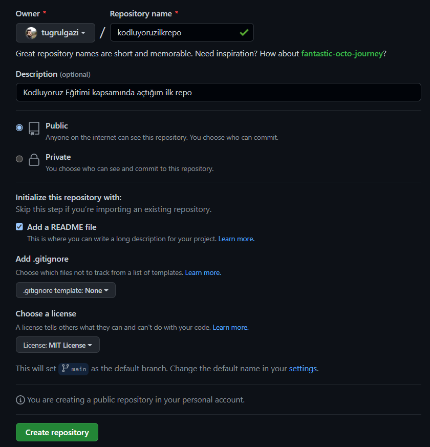

# Kodluyoruz ilk Repo

Bu repo [Kodluyoruz](https://www.kodluyoruz.org/) git eğitimi kapsamında açtığım ilk repo. İçerisinde bir adet README dosyası, bir adet de index.html barındırıyor.



# Installation

Öncelikle projeyi klonlayın. (Burada kendi repomun linki var)

```
https://github.com/tugrulgazi/kodluyoruzilkrepo.git
```

# Usage

Projeyi cloneladıktan sonra Visual Studio Code programında açınız.

Linux için:

``` 
cd kodluyoruzilkrepo
code . 
```

# Contributing

Pull requestler kabul edilir. Büyük değişiklikler için, lütfen önce neyi değiştirmek istediğinizi tartışmak için bir konu açınız.

# License
[MIT](https://choosealicense.com/licenses/mit/)
